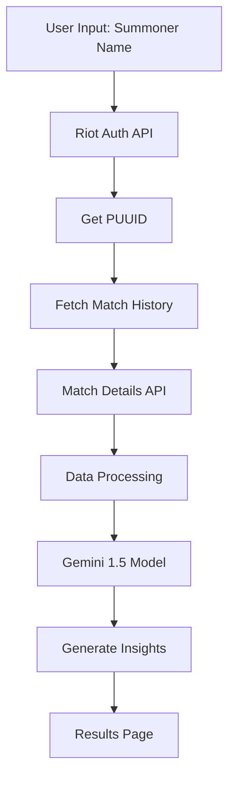

# TiltQ

Your ultimate League of Legends companion for those heated moments. TiltQ is designed to help players manage their gaming experience and maintain a positive mindset.
Almost 3k people used tiltq within the first 24 hours of launch!


Try it now: https://tiltq.com

## Overview
TiltQ is a funny web application designed to enhance your League of Legends experience by providing real-time insights, tilt management strategies, and performance analytics. Whether you're a casual player or climbing the ranked ladder, TiltQ helps you maintain composure and improve your enemy's gameplay via positive insights and feedback!

## 🚀 Features

- **Smart Tilt Detection**: "Advanced algorithms" to detect patterns to purposly generate a tilt response 
- **Real-time Match Analysis**: Get instant insights of your prev matches
- **Performance Tracking**: Calculates your progress and identify patterns in your gameplay
- **Personalized Recommendations**: Receive tailored advice based on your playstyle and history
- **Modern UI/UX**: Clean, responsive interface built with Next.js 14
- **Cross-Platform**: Access your insights from any device

## 🎮 How It Works

1. **Prompt**: Prompts user to enter their RIOT ID!
2. **Start**: Instantly get a tailored response!
3. **Copy**: Quick copy feature!
4. **Paste**: Paste in game!

## 🛠️ Tech Stack

- **Framework:** Next.js 14
- **Styling:** Tailwind CSS
- **AI Model:** Google Gemini 1.5
- **Game Data:** Riot Games API
- **Analytics:** 
  - Google Analytics 4
  - Vercel Analytics
- **Language:** TypeScript

## 🧠 AI Integration

TiltQ uses a "sophisticated" pipeline to generate personalized insights:

1. **Data Collection**
   - Username to PUUID conversion via Riot API
   - Fetch last 10 matches using PUUID
   - Extract detailed match data for each game

2. **Data Processing**
   - Parse match statistics (KDA, vision score, objectives)
   - Analyze player behavior patterns
   - Track tilt indicators (death sprees, chat patterns)

3. **Gemini 1.5 Integration**
   - Fine-tuned on League of Legends terminology
   - "Trained" on pro player behaviors
   - Incorporates common League slang and memes
   - Contextual understanding of game states

4. **Response Generation**
   - Combines match analysis with player history
   - Generates personalized feedback
   - Mixes humor with actionable advice

## 📚 Project Structure

```
tiltq/
├── .next/                    # Next.js build output
├── node_modules/            # Dependencies
├── public/                  # Static assets
├── src/
│   └── app/
│       ├── api/
│       │   ├── matches/     # Match history endpoints
│       │   │   └── route.ts
│       │   ├── matchId/     # Individual match data
│       │   │   └── route.ts
│       │   ├── player/      # Player info endpoints
│       │   │   └── route.ts
│       │   └── stats/       # Statistics endpoints
│       │       └── route.ts
│       ├── components/      # Shared components
│       │   ├── About.tsx
│       │   └── Footer.tsx
│       ├── privacy/         # Privacy pages
│       │   └── page.tsx
│       ├── results/         # Match results pages
│       │   └── page.tsx
│       ├── favicon.ico
│       ├── globals.css
│       ├── layout.tsx
│       └── page.tsx
├── .env.local               # Environment variables
├── .gitignore
├── eslint.config.mjs
├── next-env.d.ts
├── next.config.ts
├── package-lock.json
├── package.json
├── postcss.config.mjs
└── tsconfig.json
```

## 🔄 Data Flow



## 🤝 Contributing

We welcome contributions! If you have suggestions or find bugs, please open an issue on our [GitHub repository](https://github.com/tmanzhe/tiltq/issues).

## 📄 License

This project is licensed under the terms of the [MIT License](LICENSE).

## 🙏 Acknowledgments

- Next.js team for the amazing framework
- Vercel for hosting and analytics
- League of Legends community for inspiration and support
- Riot Games for their comprehensive API (lol)
- Google for Gemini 1.5 access

---

Made with ❤️ for league of legends 
