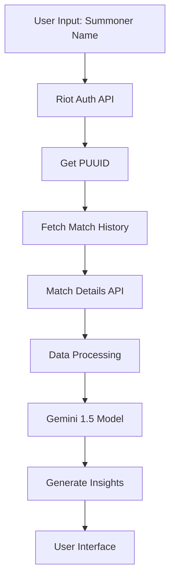

# TiltQ

Your ultimate League of Legends companion for those heated moments. TiltQ is designed to help players manage their gaming experience and maintain a positive mindset.

Try it now: https://tiltq.com

## Overview
TiltQ is a funny web application designed to enhance your League of Legends experience by providing real-time insights, tilt management strategies, and performance analytics. Whether you're a casual player or climbing the ranked ladder, TiltQ helps you maintain composure and improve your enemy's gameplay via positive insights and feedback!

## 🚀 Features

- **Smart Tilt Detection**: Advanced algorithms to detect and prevent tilt before it affects your gameplay
- **Real-time Match Analysis**: Get instant insights during your matches
- **Performance Tracking**: Track your progress and identify patterns in your gameplay
- **Personalized Recommendations**: Receive tailored advice based on your playstyle and history
- **Modern UI/UX**: Clean, responsive interface built with Next.js 14
- **Cross-Platform**: Access your insights from any device

## 🎮 How It Works

1. **Connect**: Link your League of Legends account
2. **Play**: Queue up and play your games normally
3. **Monitor**: TiltQ analyzes your performance in real-time
4. **Improve**: Get actionable insights and recommendations

## 🛠️ Tech Stack

- **Framework:** Next.js 14
- **Styling:** Tailwind CSS
- **AI Model:** Google Gemini 1.5
- **Game Data:** Riot Games API
- **Analytics:** 
  - Google Analytics 4
  - Vercel Analytics
- **Language:** TypeScript

## 🧠 AI Integration

TiltQ uses a sophisticated pipeline to generate personalized insights:

1. **Data Collection**
   - Username to PUUID conversion via Riot API
   - Fetch last 10 matches using PUUID
   - Extract detailed match data for each game

2. **Data Processing**
   - Parse match statistics (KDA, vision score, objectives)
   - Analyze player behavior patterns
   - Track tilt indicators (death sprees, chat patterns)

3. **Gemini 1.5 Integration**
   - Fine-tuned on League of Legends terminology
   - Trained on pro player behaviors
   - Incorporates common League slang and memes
   - Contextual understanding of game states

4. **Response Generation**
   - Combines match analysis with player history
   - Generates personalized feedback
   - Mixes humor with actionable advice

## 📚 Project Structure

```
tiltq/
├── src/
│   ├── app/
│   │   ├── components/          # React components
│   │   │   ├── match/          # Match-specific components
│   │   │   ├── analysis/       # Analysis visualization
│   │   │   └── insights/       # AI-generated insights
│   │   ├── api/                # API routes
│   │   │   ├── riot/          # Riot Games API integration
│   │   │   └── gemini/        # Gemini API handlers
│   │   ├── lib/
│   │   │   ├── riot/          # Riot API utilities
│   │   │   │   ├── auth.ts    # Authentication
│   │   │   │   ├── match.ts   # Match data fetching
│   │   │   │   └── player.ts  # Player data handling
│   │   │   ├── gemini/        # Gemini integration
│   │   │   │   ├── prompt.ts  # Prompt engineering
│   │   │   │   └── train.ts   # Fine-tuning utilities
│   │   │   └── utils/         # Helper functions
│   │   ├── types/             # TypeScript definitions
│   │   ├── layout.tsx         # App layout
│   │   └── page.tsx           # Main page
│   └── services/
│       ├── matchAnalysis.ts   # Match analysis logic
│       ├── tiltDetection.ts   # Tilt detection algorithms
│       └── insightEngine.ts   # AI insight generation
├── public/                    # Static assets
├── scripts/
│   ├── train-gemini.ts       # Gemini training script
│   └── data-collection.ts    # Riot data collection
├── tests/                    # Test suites
└── package.json
```

## 🔄 Data Flow



## 🤝 Contributing

We welcome contributions! If you have suggestions or find bugs, please open an issue on our [GitHub repository](https://github.com/tmanzhe/tiltq/issues).

## 📄 License

This project is licensed under the terms of the MIT license.

## 👥 Team

- Manzhe Tang - [@tmanzhe](https://github.com/tmanzhe)

## 🙏 Acknowledgments

- Next.js team for the amazing framework
- Vercel for hosting and analytics
- League of Legends community for inspiration and support
- Riot Games for their comprehensive API (lol)
- Google for Gemini 1.5 access

---

Made with ❤️ for league of legens 
